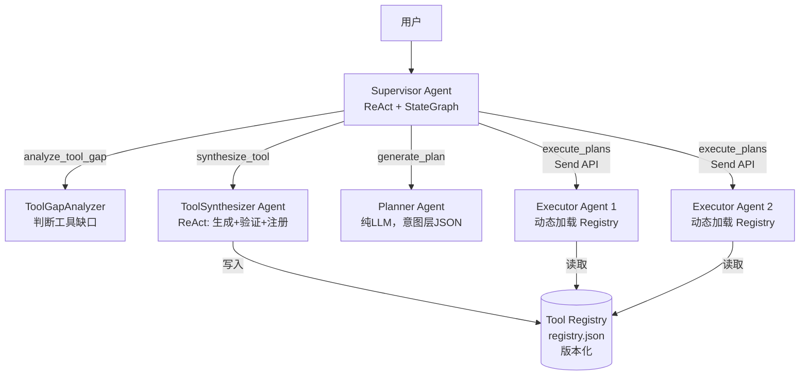

## 用户需求

为全新项目 **ToolForge Agent** 生成完整的架构设计文档（`CLAUDE.md`），该文档将作为新项目的核心工程指导文件，风格与 `AutoDL_Agent/CLAUDE.md` 完全一致。

## 产品定位

**ToolForge Agent** 是一个通用 Self-Extending AI Agent，核心能力是根据任意用户需求自动合成新工具并立即投入使用，实现工具池的持续自我扩展。

## 核心特性

- **工具自合成**：Agent 自主发现工具缺口（或响应用户显式请求），调用 ToolSynthesizer Agent 生成 Python 工具函数代码，经 subprocess 沙箱验证后注册到 Tool Registry
- **立即投入使用**：工具注册后，下一个新 Executor 实例创建时动态加载最新工具集，无需重启进程
- **持久化工具注册表**：Tool Registry 以 JSON 文件持久化，每次工具修改自动 version 自增，支持按版本号回滚
- **步骤级并行执行**：Planner 标记 `parallelizable=true` 的 steps，通过 LangGraph Send API 并发分发多个 Executor 实例执行
- **请求级并行**：每个用户请求分配唯一 `thread_id`，开发阶段使用 `InMemorySaver`，生产使用 `AsyncRedisSaver`
- **双路触发**：Agent 自主判断工具缺口（`analyze_tool_gap` 节点）+ 用户主动请求合成工具两种模式均支持
- **安全沙箱**：继承 AutoDL_Agent 的命令黑名单机制，合成代码在 subprocess 隔离环境中验证，超时 30s，后续可迁移 Docker

## 技术栈

完全复用 AutoDL_Agent 现有技术栈：

- **框架**：LangGraph >= 0.6.0 + LangChain
- **语言**：Python 3.11+
- **包管理**：uv
- **模型**：Supervisor 使用 `qwen:qwen-flash`，Planner / ToolSynthesizer / Executor 使用 `siliconflow:Pro/deepseek-ai/DeepSeek-V3.2`
- **状态持久化**：开发阶段 `MemorySaver` / `InMemorySaver`，生产阶段 `AsyncRedisSaver`
- **工具注册表**：本地 JSON 文件（`tool_registry/registry.json`）
- **代码质量**：Ruff + MyPy，Google-style docstrings
- **测试**：pytest + pytest-asyncio

## 实现策略

在 AutoDL_Agent 三层架构基础上，增加第四层 **ToolSynthesizer Agent**，并在 Supervisor 工具集中新增 `analyze_tool_gap` 和 `synthesize_tool` 两个工具。所有继承自 AutoDL_Agent 的关键设计（InjectedState 防幻觉传参、意图层解耦、ExecutorResult 结构化返回、dynamic_tools_node 双向同步）全部保留，在此基础上叠加新能力。

**关键决策**：

- Tool Registry 用 JSON 文件而非数据库，保持零依赖、可 git 追踪
- 工具热投入使用"新 Executor 实例"方案（而非 importlib 热 reload），避免模块状态污染
- 并行调度使用 LangGraph 原生 `Send API`，避免引入外部任务队列
- ToolSynthesizer 内置重试逻辑（最多 3 次），失败原因回传 Supervisor

## 架构设计



## 目录结构

```
ToolForge_Agent/
├── CLAUDE.md                          # [NEW] 项目架构设计文档（本次输出目标）
├── ROADMAP.md                         # [NEW] 版本路线图
├── README.md                          # [NEW] 项目介绍
├── langgraph.json                     # [NEW] LangGraph 图注册入口
├── pyproject.toml                     # [NEW] 项目依赖，复用 AutoDL_Agent 依赖集
├── Makefile                           # [NEW] 开发命令（dev/lint/test 等）
├── .env.example                       # [NEW] 环境变量模板
├── tool_registry/
│   └── registry.json                  # [NEW] 工具注册表持久化文件（运行时生成）
├── src/
│   ├── supervisor_agent/
│   │   ├── graph.py                   # [NEW] 主循环图，含 analyze_tool_gap 路由节点
│   │   ├── state.py                   # [NEW] State/InputState/PlannerSession/SynthesizerSession
│   │   ├── tools.py                   # [NEW] generate_plan/execute_plans/analyze_tool_gap/synthesize_tool
│   │   └── prompts.py                 # [NEW] SYSTEM_PROMPT（含工具合成职责说明）
│   ├── planner_agent/
│   │   ├── graph.py                   # [NEW] 复用 AutoDL_Agent 结构，Plan schema 新增 parallelizable 字段
│   │   ├── state.py                   # [NEW] PlannerState
│   │   └── prompts.py                 # [NEW] PLANNER_SYSTEM_PROMPT（含 parallelizable 字段说明）
│   ├── synthesizer_agent/
│   │   ├── graph.py                   # [NEW] ToolSynthesizer ReAct 图，run_synthesizer() 对外接口
│   │   ├── state.py                   # [NEW] SynthesizerState / SynthesizerResult
│   │   ├── tools.py                   # [NEW] generate_tool_code/validate_tool_sandbox/register_tool
│   │   └── prompts.py                 # [NEW] SYNTHESIZER_SYSTEM_PROMPT
│   ├── executor_agent/
│   │   ├── graph.py                   # [NEW] 复用 AutoDL_Agent，新增动态从 Registry 加载工具
│   │   ├── state.py                   # [NEW] ExecutorState / ExecutorResult
│   │   ├── tools.py                   # [NEW] 内置工具（write_file/run_local_command）+ 动态工具加载
│   │   └── prompts.py                 # [NEW] EXECUTOR_SYSTEM_PROMPT
│   └── common/
│       ├── context.py                 # [NEW] Context 配置（新增 TOOL_REGISTRY_PATH/MAX_SYNTH_RETRIES）
│       ├── prompts.py                 # [NEW] 全局 SYSTEM_PROMPT
│       ├── utils.py                   # [NEW] load_chat_model 统一入口（复用）
│       ├── registry.py                # [NEW] ToolRegistry 类：load/save/register/rollback/list
│       └── models/
│           ├── qwen.py                # [NEW] 复用 AutoDL_Agent
│           └── siliconflow.py         # [NEW] 复用 AutoDL_Agent
└── tests/
    ├── unit_tests/
    │   ├── synthesizer_agent/         # [NEW] ToolSynthesizer 单元测试
    │   ├── common/                    # [NEW] ToolRegistry 单元测试
    │   └── executor_agent/            # [NEW] 动态工具加载测试
    └── integration_tests/             # [NEW] 端到端工具合成流程测试
```

## 关键代码结构

### Tool Registry Schema

```python
@dataclass
class ToolEntry:
    name: str
    description: str
    version: int                    # 自增，从 1 开始
    code: str                       # 完整 Python 函数定义
    is_active: bool
    created_at: str                 # ISO8601
    updated_at: str
    history: list[ToolHistoryEntry] # 所有旧版本快照

@dataclass
class ToolHistoryEntry:
    version: int
    code: str
    updated_at: str
```

### SynthesizerResult

```python
@dataclass
class SynthesizerResult:
    status: Literal["registered", "failed"]
    tool_name: str
    version: int | None             # 注册成功时的版本号
    error_detail: str | None        # 失败原因
    retry_count: int                # 实际重试次数
```

### Plan Step Schema（新增字段）

```python
{
  "step_id": "step_1",
  "intent": "...",
  "expected_output": "...",
  "parallelizable": False,          # 新增：是否可并行
  "depends_on": [],                 # 新增：依赖的 step_id 列表
  "status": "pending",
  "result_summary": None,
  "failure_reason": None
}
```